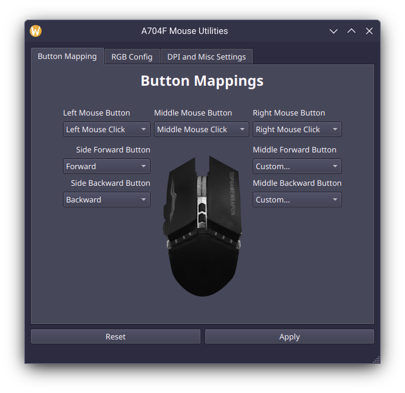
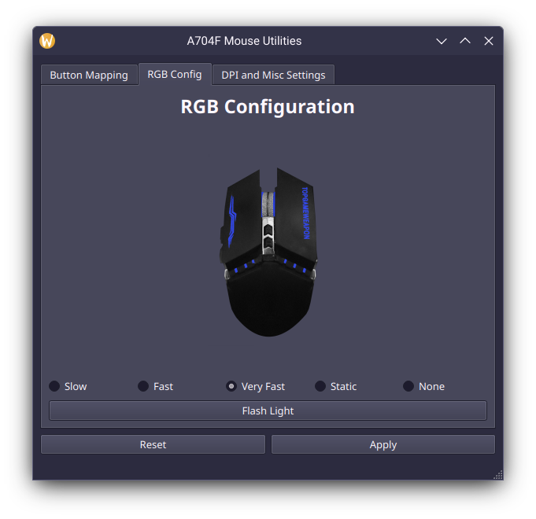
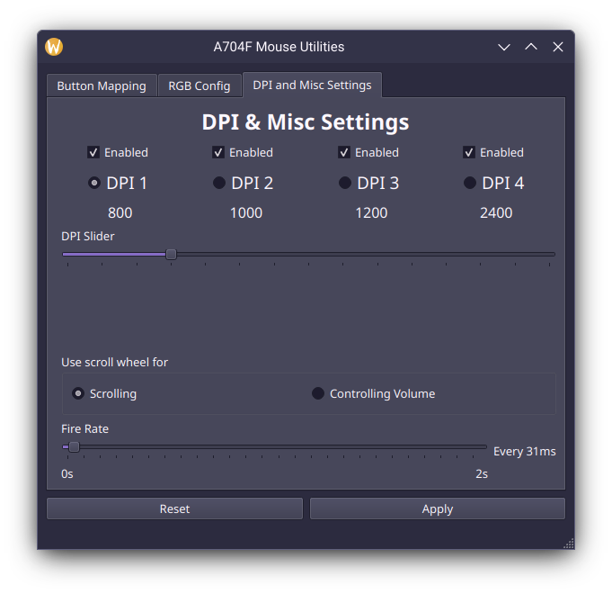

# Instant A704F Mouse Utilities for Linux
This is a mouse configuration tools for the [A704F Gaming Mouse IC](https://instant-sys.com/uploads/pdf/norm/SPEC/A704F_SPEC_EN.V1.00.pdf) by Instant Microelectronics.  

 

Configurable items including custom button bindings, change speed of breathing light and DPI configuration.  

<table>
    <tr>
        <td></td>
        <td></td>
        <td></td>
    </tr>
</table>

Vendor ID/Product ID: `18f8:1286`  
idk maybe when I finish the blog I am writing then this repo would make more sense :)

## Installation & Usage
**For Debian-based users:**
- Download the deb from the [release page](https://github.com/Kenny-Hui/Instant-A704F-Mouse-Utilities/releases/latest) and install it.

**For other distribution:**
Sorry I do not know how to or I am too lazy to package.

0. Make sure you have Qt 6 installed.
1. Download the binary from the [release page](https://github.com/Kenny-Hui/Instant-A704F-Mouse-Utilities/releases/latest)
2. Put it in an safe location
3. Run it!

### Flags
`--apply` - Apply settings to the mouse unattendedly without launching a GUI (As the mouse does not store settings persistently)  
`--daemon` - Start a background daemon, this is required to handle key input functionalities.

A common setup is to add an autostart entry with the program argument `--apply --daemon` so that it applies the mouse settings on startup and run persistently in the background.

## Build from Source
```
git clone https://github.com/Kenny-Hui/Instant-A704F-Mouse-Utilities
cd Instant-A704F-Mouse-Utilities
mkdir build
cd build
cmake ..
make
```

To install:
```
make install
```

## License
This project is licensed under the MIT License.